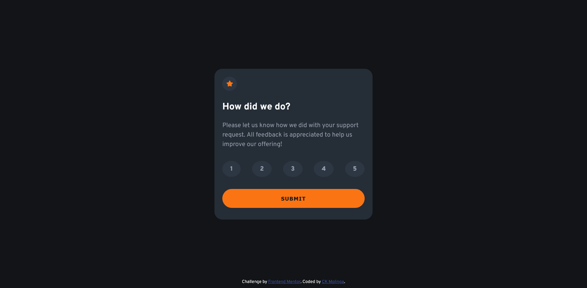
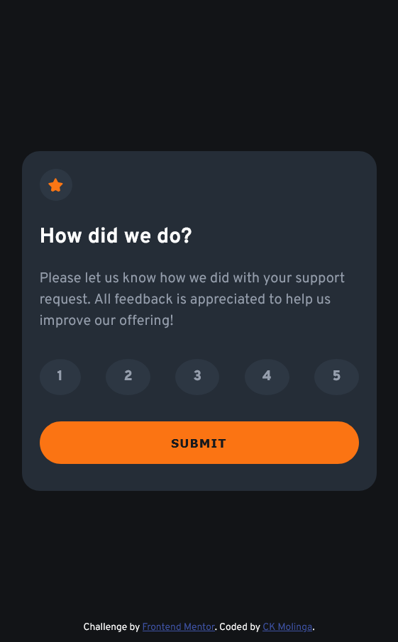
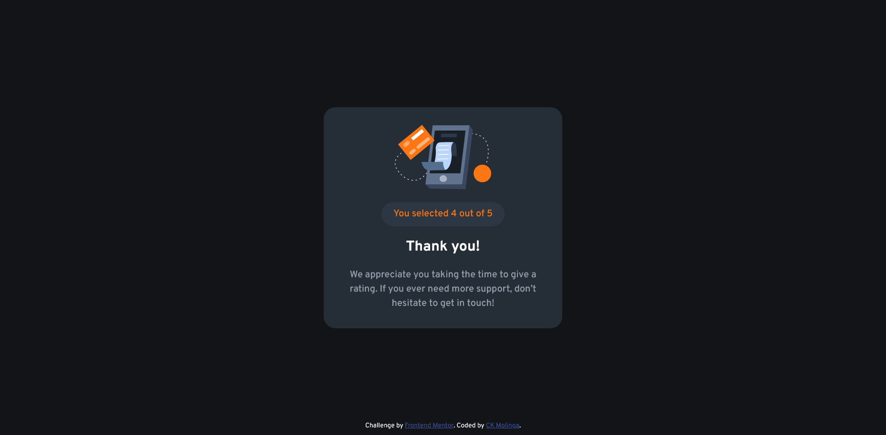
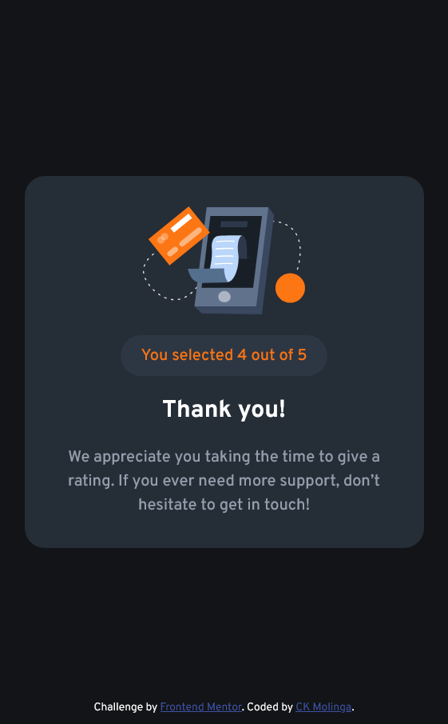

# Frontend Mentor - Interactive rating component solution

This is a solution to the [Interactive rating component challenge on Frontend Mentor](https://www.frontendmentor.io/challenges/interactive-rating-component-koxpeBUmI). Frontend Mentor challenges help you improve your coding skills by building realistic projects.

## Table of contents

- [Frontend Mentor - Interactive rating component solution](#frontend-mentor---interactive-rating-component-solution)
  - [Table of contents](#table-of-contents)
  - [Overview](#overview)
    - [The challenge](#the-challenge)
    - [Screenshot](#screenshot)
    - [Links](#links)
  - [My process](#my-process)
    - [Built with](#built-with)
    - [What I learned](#what-i-learned)
    - [Continued development](#continued-development)
    - [Useful resources](#useful-resources)
  - [Author](#author)
  - [Acknowledgments](#acknowledgments)

**Note: Delete this note and update the table of contents based on what sections you keep.**

## Overview

This is a solution to the Interactive rating component challenge on Frontend Mentor. Users should be able to select a number rating and submit their feedback. After submitting, users will see a "Thank you" card with their selected rating.

### The challenge

Users should be able to:

- View the optimal layout for the app depending on their device's screen size
- See hover states for all interactive elements on the page
- Select and submit a number rating
- See the "Thank you" card state after submitting a rating

### Screenshot

### Links

- Solution URL: [Github Repo](https://github.com/CKMolinga/Frontend-Mentor-Challenges/tree/main/interactive-rating-component-main)
- Live Site URL: [Add live site URL here](https://your-live-site-url.com)

## My process

- I started by looking at the design and making sure I understood all the requirements of the project. Then I set up my development environment.
- Next, I created the basic HTML structure of the page, including the necessary elements for the rating component and the thank you state. I made sure to use semantic HTML5 markup to ensure that my code was accessible and easy to understand.
- After that, I moved on to styling the page using CSS. I used a mobile-first approach to ensure that the design looked good on all screen sizes. I also made use of CSS custom properties to make it easier to manage my styles and ensure consistency across the page. I used Flexbox create the layout of the page and ensure that it was responsive.
- Finally, I added interactivity to the page using JavaScript. I created event listeners for the rating buttons and the submit button to handle user interactions/events and update the page accordingly. I also made sure to test my code thoroughly to ensure that everything was working as expected.

### Built with

- Semantic HTML5 markup
- CSS custom properties
- Flexbox
- Mobile-first workflow
- [Fonts](https://fonts.googleapis.com/css2?family=Overpass:ital,wght@0,100..900;1,100..900&display=swap) - Google Fonts

### What I learned

This project was a great opportunity for me to practice building a responsive layout using Flexbox and CSS custom properties. I also got to work on my JavaScript skills practicing event handling and DOM manipulation. Overall, I learned a lot about how to create a user-friendly and visually appealing rating component that works well on both desktop and mobile devices. I also learned the importance of testing my code thoroughly to ensure that it works as expected and provides a good user experience.

### Continued development

In the future, I would like to add some additional features to this project, such as:

- Adding animations to the rating buttons and the thank you state to make the user experience more engaging.
- Implementing a backend to store user ratings and feedback, which would allow for more advanced features such as displaying average ratings and user comments.

### Useful resources

- [W3Schools](https://www.w3schools.com/css/css3_flexbox_responsive.asp) - This helped me understand how to use Flexbox for responsive design.
- [CSS-Tricks](https://css-tricks.com/snippets/css/a-guide-to-flexbox/) - A comprehensive guide to Flexbox that I referred to multiple times during the project.

## Author

- Github - [CKMolinga](https://github.com/CKMolinga)
- Frontend Mentor - [CKMolinga](https://www.frontendmentor.io/profile/CKMolinga)
- LinkedIn - [Charles Kombe Molinga](www.linkedin.com/in/ck-molinga)

## Acknowledgments

I would like to thank the Frontend Mentor community for providing such a great platform for learning and improving my coding skills. The challenges are well-designed and provide a great opportunity for developers of all skill levels to practice their craft. I also want to thank my peers and mentors who provided feedback and support throughout the development process.
