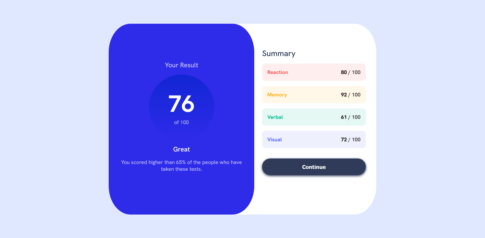
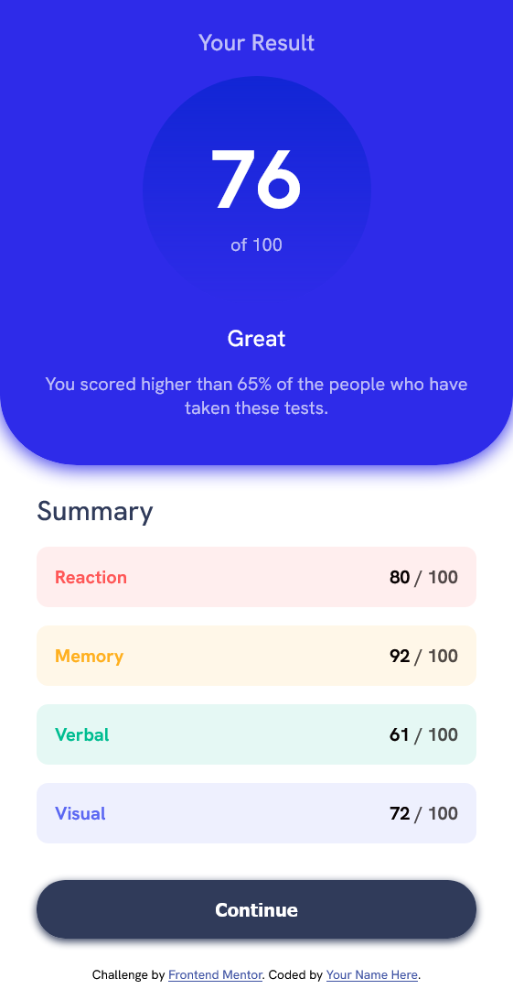

# Frontend Mentor - Results summary component solution

This is a solution to the [Results summary component challenge on Frontend Mentor](https://www.frontendmentor.io/challenges/results-summary-component-CE_K6s0maV). Frontend Mentor challenges help you improve your coding skills by building realistic projects.

## Table of contents

- [Frontend Mentor - Results summary component solution](#frontend-mentor---results-summary-component-solution)
  - [Table of contents](#table-of-contents)
  - [Overview](#overview)
    - [The challenge](#the-challenge)
    - [Screenshot](#screenshot)
    - [Links](#links)
    - [Built with](#built-with)
    - [What I learned](#what-i-learned)
    - [Continued development](#continued-development)
  - [Author](#author)
  - [Acknowledgments](#acknowledgments)

## Overview

This is a results summary component that displays a user's performance across various categories. The design is clean and modern, with a focus on clarity and ease of understanding.

### The challenge

Users should be able to:

- View the optimal layout for the interface depending on their device's screen size
- See hover and focus states for all interactive elements on the page
- **Bonus**: Use the local JSON data to dynamically populate the content

### Screenshot

### Links

- Solution URL: [Add solution URL here](https://github.com/CKMolinga/Frontend-Mentor-Challenges/tree/main/results-summary-component-main)
- Live Site URL: [Add live site URL here](https://results-summary-component-charles.netlify.app/)

### Built with

- Semantic HTML5 markup
- CSS custom properties
- Flexbox
- Mobile-first workflow

### What I learned

During this challenge, I learned how to effectively use Flexbox to create a responsive layout that adapts to different screen sizes. I also improved my skills in styling hover and focus states for interactive elements, ensuring better accessibility for users navigating with keyboards or assistive technologies.

### Continued development

I plan to continue developing my skills in responsive design and accessibility. In future projects, I want to explore CSS Grid for more complex layouts and deepen my understanding of ARIA roles and attributes to enhance the accessibility of my web applications.

## Author

- Github - [Charles Kombe](https://github.com/CKMolinga)
- Frontend Mentor - [CK Molinga](https://www.linkedin.com/in/ck-molinga/)
- LinkedIn - [Charles Kombe](https://www.linkedin.com/in/charles-kombe/)

## Acknowledgments

I would like to thank the Frontend Mentor community for providing such engaging challenges that help developers like me improve our skills. Special thanks to anyone who provided feedback on my solution!
