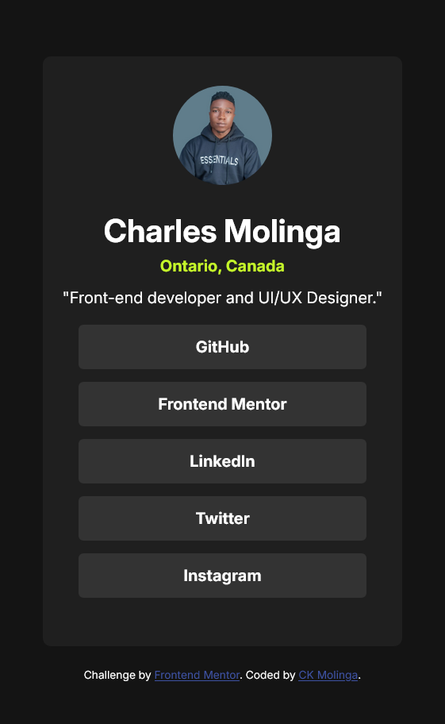
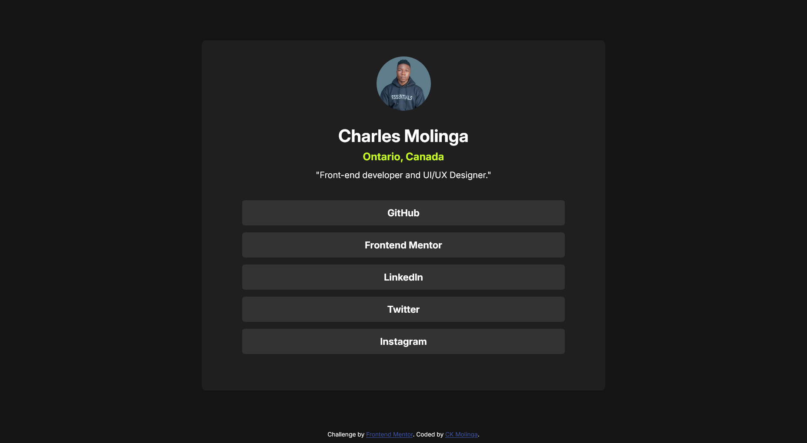

# Frontend Mentor - Social links profile solution

This is a solution to the [Social links profile challenge on Frontend Mentor](https://www.frontendmentor.io/challenges/social-links-profile-UG32l9m6dQ). Frontend Mentor challenges help you improve your coding skills by building realistic projects.

## Table of contents

- [Frontend Mentor - Social links profile solution](#frontend-mentor---social-links-profile-solution)
  - [Table of contents](#table-of-contents)
  - [Overview](#overview)
    - [The challenge](#the-challenge)
    - [Screenshot](#screenshot)
    - [Links](#links)
  - [My process](#my-process)
    - [Built with](#built-with)
    - [What I learned](#what-i-learned)
    - [Continued development](#continued-development)
  - [Author](#author)
  - [Acknowledgments](#acknowledgments)

## Overview

This is a simple social links profile page that displays a user's profile picture, name, a brief description, and links to their social media profiles. The design is clean and modern, with a focus on usability and accessibility.

### The challenge

Users should be able to:

- See hover and focus states for all interactive elements on the page

### Screenshot

### Links

- Solution URL: [Github Repo](https://github.com/CKMolinga/Frontend-Mentor-Challenges/tree/main/social-links-profile-main)
- Live Site URL: [Live site on Netlify](https://social-profilelinks-charles.netlify.app/)

## My process

### Built with

- Semantic HTML5 markup
- CSS properties
- Flexbox
- Mobile-first workflow
- [Styled Components](https://fonts.googleapis.com/css2?family=DM+Serif+Display:ital@1&family=Inter:ital,opsz,wght@0,14..32,100..900;1,14..32,100..900&family=Karla:ital,wght@0,200..800;1,200..800&family=Roboto:ital,wght@0,100..900;1,100..900&display=swap) - Google Fonts

### What I learned

During this challenge, I learned how to effectively use Flexbox to create a responsive layout that adapts to different screen sizes. I also improved my skills in styling hover and focus states for interactive elements, ensuring better accessibility for users navigating with keyboards or assistive technologies.

### Continued development

I plan to continue developing my skills in responsive design and accessibility. In future projects, I want to explore CSS Grid for more complex layouts and deepen my understanding of ARIA roles and attributes to enhance the accessibility of my web applications.

## Author

- Github - [Charles Kombe](https://github.com/CKMolinga)
- Frontend Mentor - [CK Molinga](https://www.linkedin.com/in/ck-molinga/)
- LinkedIn - [Charles Kombe](https://www.linkedin.com/in/charles-kombe/)

## Acknowledgments

I would like to thank the Frontend Mentor community for providing such valuable resources and challenges that help developers like me improve our skills. A special thanks to my peers who provided feedback and support throughout this project.
