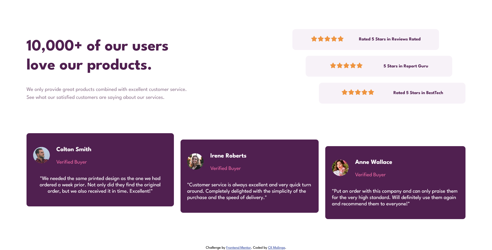
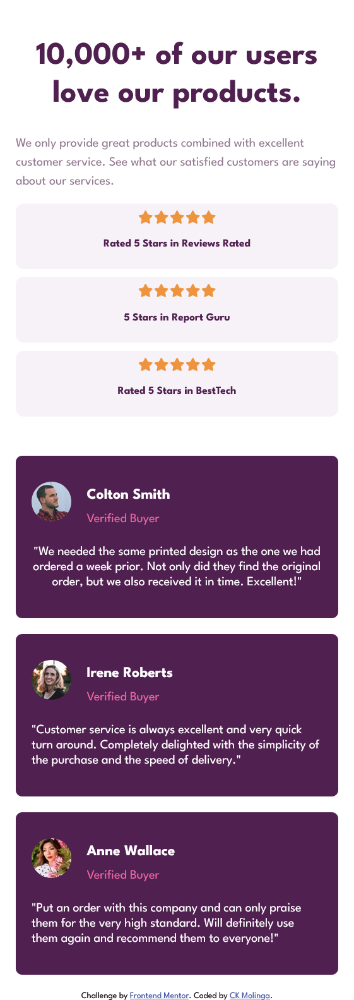

# Frontend Mentor - Social proof section solution

This is a solution to the [Social proof section challenge on Frontend Mentor](https://www.frontendmentor.io/challenges/social-proof-section-6e0qTv_bA). Frontend Mentor challenges help you improve your coding skills by building realistic projects.

## Table of contents

- [Frontend Mentor - Social proof section solution](#frontend-mentor---social-proof-section-solution)
  - [Table of contents](#table-of-contents)
  - [Overview](#overview)
    - [The challenge](#the-challenge)
    - [Screenshot](#screenshot)
    - [Links](#links)
  - [My process](#my-process)
    - [Built with](#built-with)
    - [What I learned](#what-i-learned)
    - [Continued development](#continued-development)
    - [Useful resources](#useful-resources)
  - [Author](#author)
  - [Acknowledgments](#acknowledgments)

## Overview

This is a social proof section challenge where I had to build out a landing page and get it looking as close to the design as possible.

### The challenge

Users should be able to:

- View the optimal layout for the section depending on their device's screen size

### Screenshot

### Links

- Solution URL: [GitHub Repo](https://your-solution-url.com)
- Live Site URL: [Netlify](https://social-proof-section-charles.netlify.app/)

## My process

I started by setting up the HTML structure and then moved on to styling with CSS. I focused on creating a responsive design that adapts well to different screen sizes. I used Flexbox to layout the components effectively. I also paid attention to typography and color schemes to match the design provided in the challenge.

### Built with

- Semantic HTML5 markup
- CSS custom properties
- Flexbox
- Mobile-first workflow
- [Google Fonts](https://fonts.googleapis.com/css2?family=League+Spartan:wght@100..900&display=swap") - Fonts

### What I learned

During this challenge, I learned how to effectively use Flexbox to create a responsive layout. I also improved my skills in using CSS custom properties for better maintainability of styles. Additionally, I gained experience in implementing a mobile-first design approach, ensuring that the layout looks great on all devices.

### Continued development

In future projects, I plan to further explore advanced CSS techniques such as CSS Grid for more complex layouts. I also want to enhance my understanding of responsive design principles and improve my skills in optimizing web performance for faster load times.

### Useful resources

- [Font Awesome](https://kit.fontawesome.com) - This helped me incorporate icons into my project easily. I used it to add star icons for the ratings section.
- [W3Schools](https://www.w3schools.com) - This website provided me with useful references and examples for various HTML and CSS concepts while working on this challenge.

## Author

- Github - [CKMolinga](https://github.com/CKMolinga)
- Frontend Mentor - [CKMolinga](https://www.frontendmentor.io/profile/CKMolinga)
- LinkedIn - [Charles Kombe Molinga](www.linkedin.com/in/ck-molinga)

## Acknowledgments

I would like to thank the Frontend Mentor community for providing such engaging challenges that help developers like me improve our skills. Special thanks to the designers who create the challenge designs, as they inspire me to push my creativity and technical abilities further.
