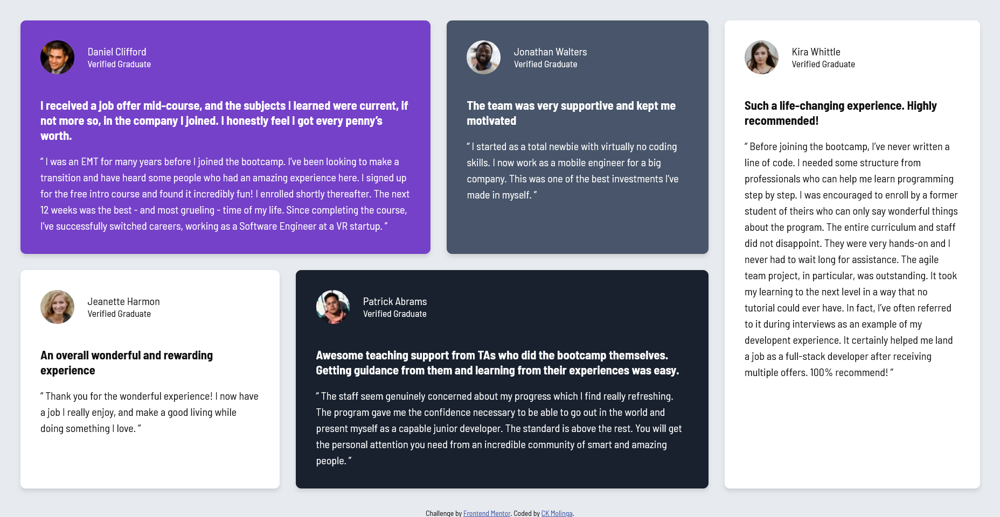
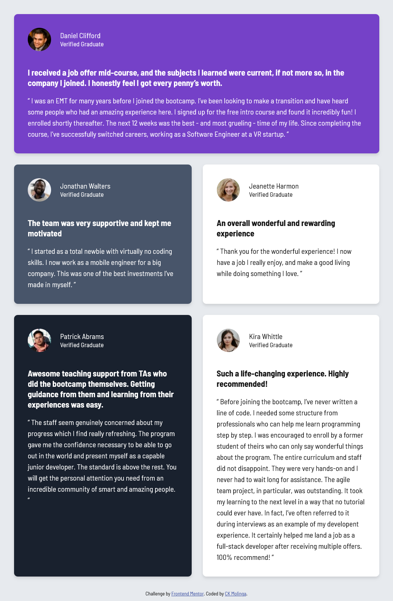

# Frontend Mentor - Testimonials grid section solution

This is a solution to the [Testimonials grid section challenge on Frontend Mentor](https://www.frontendmentor.io/challenges/testimonials-grid-section-Nnw6J7Un7). Frontend Mentor challenges help you improve your coding skills by building realistic projects.

## Table of contents

- [Frontend Mentor - Testimonials grid section solution](#frontend-mentor---testimonials-grid-section-solution)
  - [Table of contents](#table-of-contents)
  - [Overview](#overview)
    - [The challenge](#the-challenge)
    - [Screenshot](#screenshot)
    - [Links](#links)
  - [My process](#my-process)
    - [Built with](#built-with)
    - [What I learned](#what-i-learned)
    - [Continued development](#continued-development)
    - [Useful resources](#useful-resources)
  - [Author](#author)
  - [Acknowledgments](#acknowledgments)

## Overview

This is a solution to the Testimonials grid section challenge on Frontend Mentor. Users should be able to view the optimal layout for the site depending on their device's screen size.

### The challenge

Users should be able to:

- View the optimal layout for the site depending on their device's screen size

### Screenshot

### Links

- Solution URL: [Github Repository](https://github.com/CKMolinga/Frontend-Mentor-Challenges/tree/main/testimonials-grid-section-main)
- Live Site URL: [Netlify](https://testimonial-grid-charles.netlify.app/)

## My process

I started by setting up the basic HTML structure of the page, including the header, main content area, and footer. I then added the necessary CSS to style the page and make it responsive. I used Flexbox and CSS Grid to create the layout for the testimonials section, ensuring that it looked good on all screen sizes. Finally, I tested the page on different devices to ensure that it was fully responsive and made any necessary adjustments.

### Built with

- Semantic HTML5 markup
- CSS custom properties
- Flexbox
- CSS Grid
- [Google Fonts](https://fonts.google.com/) - For typography

### What I learned

This project was a great opportunity for me to practice using Flexbox and CSS Grid to create responsive layouts. I also learned how to use media queries to adjust the layout for different screen sizes. Additionally, I gained experience in testing my design on various devices to ensure that it was fully responsive. I also learned how to use Google Fonts to enhance the typography of my design.

### Continued development

I plan to continue improving my skills in responsive design and layout techniques. I want to explore more advanced CSS features and learn how to create even more complex layouts using Flexbox and CSS Grid. Additionally, I want to work on improving my testing process to ensure that my designs are fully responsive and accessible on all devices.

### Useful resources

- [CSS Grids](https://web.dev/learn/css/grid) - This helped me for XYZ reason. I really liked this pattern and will use it going forward.

## Author

- Github - 
- Frontend Mentor - [CKMolinga](https://www.frontendmentor.io/profile/CKMolinga)
- LinkedIn - [ck-molinga](https://www.linkedin.com/in/ck-molinga/)

## Acknowledgments

I would like to thank the Frontend Mentor community for providing such great challenges and resources to help me improve my coding skills. I also want to thank my friends and family for their support and encouragement throughout my learning journey.
